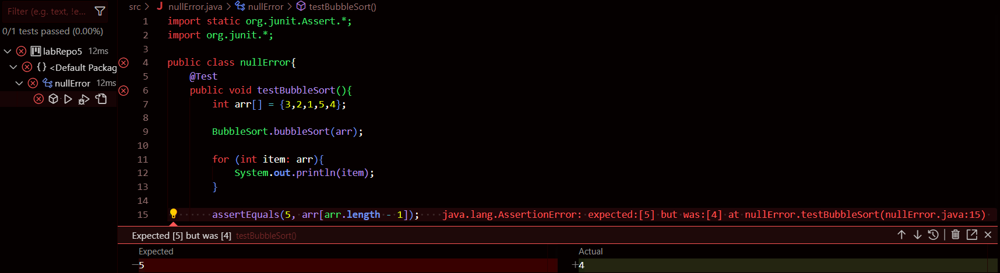

## Part 1

**What environment are you using (computer, operating system, web browser, terminal/editor, and so on)?**

* **Computer**: Asus ROG
* **Operating System**: Windows
* **Web Browser**: Google Chrome
* **Code Editor**: VScode

**Detail the symptom you're seeing. Be specific; include both what you're seeing and what you expected to see instead. Screenshots are great, copy-pasted terminal output is also great. Avoid saying "it doesn't work".**

The symptom presented below shows that the output is the second to last element when the array is supposedly sorted in ascending order. The code respective to the symptom is. The expected output is detailed by the `assertEquals()` method.

```
public class BubbleSort{
    public static void bubbleSort(int arr[]){
        for (int i = 0; i < arr.length; ++i){
            for (int j = 0; j < arr.length - i - 2; ++j) {
                if (arr[j] > arr[j + 1]){
                    int temp = arr[j];
                    arr[j] = arr[j + 1];
                    arr[j + 1] = temp;
                }
            }
        }
        
    }
}
```




<br>

**Detail the failure-inducing input and context. That might any or all of the commands you're running, a test case, command-line arguments, working directory, even the last few commands you ran. Do your best to provide as much context as you can.**


The failure inducing input would be the expectation that the greatest and last element of the sorted array would be 5, that is, `asserEquals(5, arr.length() - 1)`. I am attempting to run my own rendition of the bubble sort algorithm but it seems to not have taken into account the greatest element of the array, in this case, `5`.


<br>

**TA Response**

Looking at the bubbleSort code, it seems to not take into account the last element of the array when comparing and swapping values. I would suggest revising the inner for loop's definition.

<br>

**Fixed Code**


